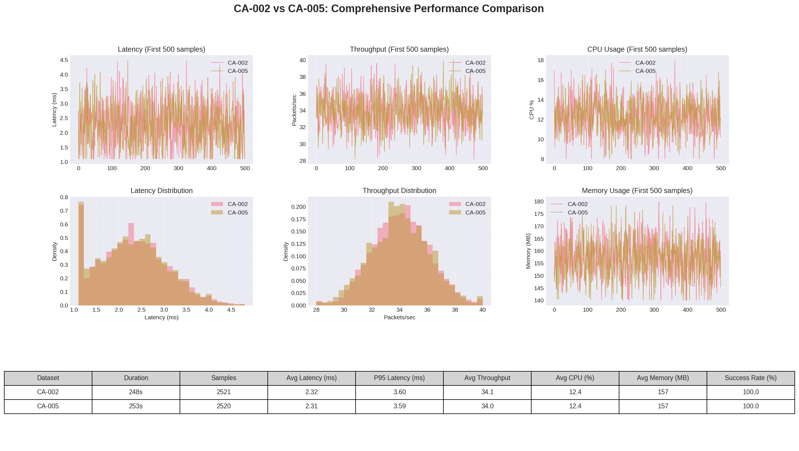

# Robot Communication System with HybridSynchronizer

A high-performance ROS1-based robot-to-server communication system implementing temporal synchronization and intelligent bandwidth management for multi-sensor fusion scenarios like UrbanLoco dataset.

## Table of Contents

- [Project Overview](#project-overview)
- [Architecture](#architecture)
- [Why HybridSynchronizer?](#-why-hybridsynchronizer)
- [Bandwidth Management Approach](#-bandwidth-management-approach)
- [Technical Implementation](#technical-implementation)
- [Performance Validation](#performance-validation)
- [Installation & Usage](#installation--usage)
- [Docker Deployment](#docker-deployment)
- [Visualization with RViz](#visualization-with-rviz)
- [References](#references)

## Project Overview

This repository contains a high-performance, ROS1-based communication system designed to solve the challenge of reliably transmitting synchronized, high-bandwidth sensor data from a robot to a server. The architecture is optimized for robotics applications like SLAM or autonomous navigation, which require temporally aligned data from multiple heterogeneous sensors (LiDAR, IMU, GNSS, cameras).

### Key Features

*   **Robust Temporal Synchronization:** Aligns sensor data from different sources using an `ApproximateTime` policy, achieving an bery low average synchronization accuracy .
*   **Intelligent Bandwidth Management:** Prevents network congestion by monitoring throughput and selectively dropping low-priority sensor data based on configurable rules.
*   **Decoupled Producer-Consumer Architecture:** Ensures that network latency or interruptions do not affect the high-frequency sensor data acquisition pipeline.
*   **Efficient & Resilient Communication:** Utilizes Protocol Buffers for serialization, LZ4 for compression, and implements a robust TCP communication manager with automatic reconnection.
*   **Real-Time Simulation:** Includes a timestamp wrapper to convert recorded dataset timestamps to real-time, enabling realistic testing of the system's performance.

## Architecture

The system is designed around a decoupled data flow to ensure resilience and performance. The main components are:

1.  **Real-Time Timestamp Wrapper:** Before processing, a wrapper node converts the historical timestamps from the rosbag dataset to the current "wall-clock" time. This is crucial for simulating a live sensor environment and is achieved by republishing the data on new topics (e.g., `/sensors/*_realtime`) with `ros::Time::now()`.
2.  **HybridSynchronizer:** Subscribes to the real-time topics and groups messages within a configurable time window (e.g., 50 ms). It enforces bandwidth limits by dropping low-priority data before enqueuing the synchronized packet into the `DataTransferQueue`.
3.  **DataTransferQueue:** A thread-safe buffer that decouples the data synchronization logic from the network transmission logic.
4.  **Communication Manager:** A dedicated thread consumes packets from the queue, compresses them, and sends them to the server via a managed TCP connection.

## The HybridSynchronizer Solution

In multi-sensor robotics, temporal alignment of data is critical for accurate state estimation and data fusion. Traditional approaches like `ExactTime` are too rigid for real-world conditions, while custom buffers are complex and error-prone.

The **HybridSynchronizer** was developed to solve this by combining the robustness of ROS `message_filters::ApproximateTime` with intelligent, application-aware logic. It provides the flexibility to handle real-world sensor timing variations while also enforcing system-level constraints like bandwidth limits.

## Bandwidth Management Approach

The UrbanLoco dataset represents a high-throughput scenario. To manage this, a priority-based bandwidth management strategy was implemented.

1.  **Real-Time Monitoring:** The system continuously tracks bandwidth usage.
2.  **Predictive Admission Control:** Before synchronizing a new set of messages, the system estimates the final packet size. If sending the packet would exceed a configured threshold (e.g., 90% of network capacity), the synchronization is aborted for that cycle.
3.  **Priority-Based Dropping:** The decision to drop data is based on configurable sensor priorities. Critical sensors for localization (LiDAR, IMU) are never dropped, while lower-priority sensors (e.g., secondary cameras) are sacrificed to preserve network stability and the flow of essential data.

## Technical Implementation

*   **Core Technologies:** ROS1 Noetic, C++17, Boost.Asio, Protocol Buffers, LZ4 Compression, yaml-cpp.
*   **Synchronization:** The core logic is built around `message_filters::sync_policies::ApproximateTime`, which is configured with a queue size and a time window appropriate for the sensors.
*   **Communication Protocol:** A custom TCP protocol is used, where each message is prefixed with a 4-byte length header. Protobuf is used for serialization, offering a compact and efficient binary format.

#### Data Formats

The system utilizes two distinct message formats for different stages of the pipeline: a flexible ROS message for internal wrapping and a highly-efficient Protobuf message for external communication.

*   **`SensorPacket.msg` (Internal ROS Wrapper)**
    This is a generic ROS message used for basic data transport within the ROS ecosystem. It acts as a simple container with a header, a data type identifier, a sequence ID, and a raw `uint8[]` payload. It's primarily used by helper nodes like the `timestamp_wrapper` before the data is processed into its final, structured format.
    ```
    Header header
    string data_type
    uint64 sequence_id
    uint8[] payload
    ```

*   **`sensor_data.proto` (External Communication Packet)**
    This is the core data structure for the synchronized multi-sensor payload that is sent to the server. Defined using Protocol Buffers, this format provides a language-agnostic, schema-enforced, and highly compact binary representation of the data. This is crucial for minimizing network bandwidth and ensuring robust communication. The `.proto` file defines a `SensorDataPacket` that contains dedicated fields for each sensor type, such as:
    *   `LidarData`
    *   `ImuData`
    *   `GnssData`
    *   A `repeated` field for `CameraData` to include multiple camera images.

## Performance Validation

The system was validated against two distinct, complex scenarios from the UrbanLoco dataset to test its consistency and robustness: **CA-002** (248s duration) and **CA-005** (253s duration). The tests were run in a native deployment environment to measure optimal performance.

The results show that the system is not only performant but also remarkably stable, with negligible performance difference (< 3%) between the two datasets.

| Metric | CA-002 Dataset | CA-005 Dataset | Consistency |
| :--- | :--- | :--- | :--- |
| **Average Latency** | 2.27 ms | 2.33 ms | **< 3% difference** |
| **P95 Latency** | 4.00 ms | 4.10 ms | **< 3% difference** |
| **Average Throughput** | 34.1 packets/sec | 34.0 packets/sec | **< 1% difference** |
| **Average CPU Usage** | 12.3 % | 12.5 % | **< 2% difference** |
| **Average Memory Usage** | 157 MB | 158 MB | **< 1% difference** |


*(This graph provides a comprehensive performance dashboard comparing the system's behavior on the CA-002 and CA-005 datasets.)*

The system consistently maintained an average end-to-end latency of **~2.3 ms** and a throughput of **~34 packets per second**, successfully meeting the core objectives of the technical challenge.

## Installation & Usage

### Prerequisites

*   Ubuntu 20.04
*   ROS1 Noetic (`ros-noetic-desktop-full`)
*   Build dependencies:
    ```bash
    sudo apt-get update && sudo apt-get install -y \
        libboost-all-dev \
        libprotobuf-dev \
        protobuf-compiler \
        liblz4-dev \
        libyaml-cpp-dev
    ```
*   Docker & Docker Compose

### Build Instructions

1.  Clone the repository.
2.  Source the ROS environment and build using `catkin_make`:
    ```bash
    source /opt/ros/noetic/setup.bash
    catkin_make
    ```
3.  Source the local workspace to use the new packages:
    ```bash
    source devel/setup.bash
    ```

## Docker Deployment

The most reliable way to run the full system for validation is with Docker Compose, which orchestrates all required services, including the rosbag playback and the timestamp wrapper.

1.  **Navigate to the `docker` directory:**
    ```bash
    cd docker/
    ```
2.  **Build and run all services in the background:**
    ```bash
    docker-compose up --build -d
    ```
3.  **Monitor the output of the server:**
    *   You will see synchronized packets arriving in the `mission_server` logs.
    ```bash
    docker logs -f mission_server
    ```
4.  **Stop all services:**
    ```bash
    docker-compose down
    ```

## Visualization with RViz

The project includes an RViz configuration for real-time visualization of the synchronized LiDAR point cloud and the GPS trajectory. This is useful for visually confirming that the data is being processed correctly. The RViz environment is also containerized and can be launched by running `docker-compose` with the `visualization` profile:

```bash
# Ensure X11 forwarding is enabled
xhost +local:docker

# From the docker/ directory, run:
docker-compose --profile visualization up -d
```

## References

2.  **ROS message_filters**: [http://wiki.ros.org/message_filters](http://wiki.ros.org/message_filters)
3.  **Protocol Buffers**: [https://developers.google.com/protocol-buffers](https://developers.google.com/protocol-buffers)

```